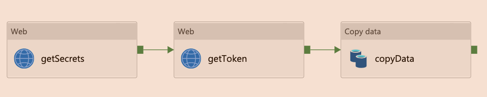
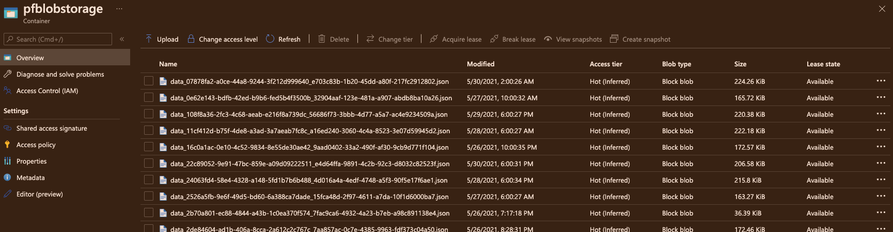
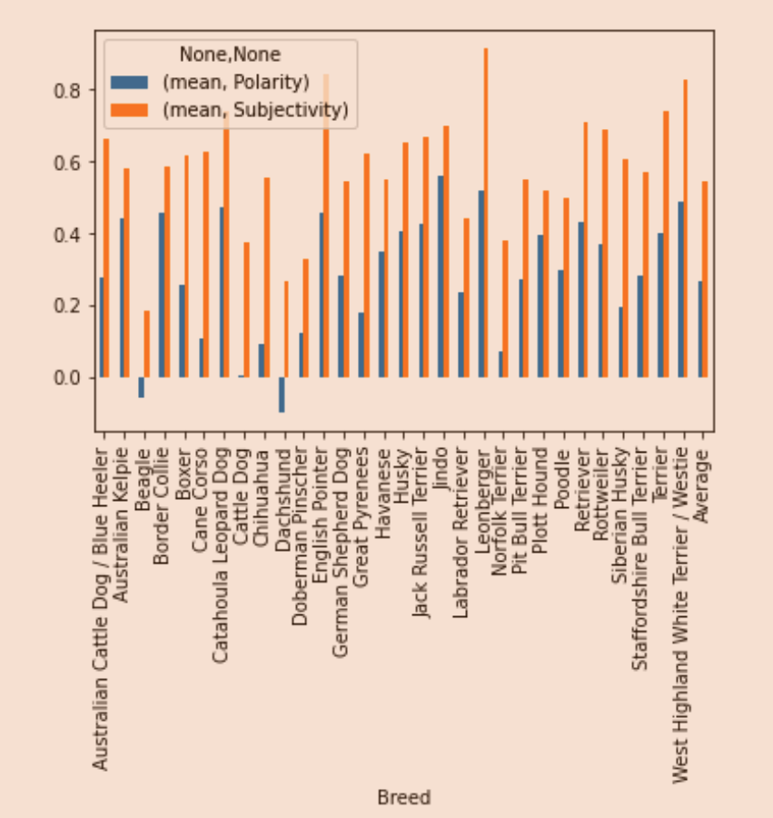

# Petfinder API Copy Pipeline

## Summary

1. Data
2. Architecture
3. Copy Pipeline

## Data - Petfinder API

The [Petfinder REST API](https://www.petfinder.com/developers/v2/docs/#introduction) allows us to search and display pet listings based on pet characteristics, location and status.

**Requirements:**

- Petfinder Account
- Petfinder API Key (Client ID and Secret)
- Access Token
  
The Petfinder API uses OAuth for secure authentication, and requires a new access token every 3600 seconds (1 hour) in order to use the API.

For this project, we use the following for our GET request:

- Base Call: `https://api.petfinder.com/v2/animals`
- Query Parameters: `?type=dog&location=Colorado&limit=100`

### JSON Response

Here is a modified sample of the JSON returned back from the Petfinder API.
We recieve back a dictonary of list items, with nested dictonaries inside of it.

```json
{
    "animals": [
        {
            "id": 1,
            "type": "Dog",
            "breeds": {
                "primary": "Siberian Husky",
                "secondary": "Malamute",
            },
            "age": "Young",
            "description": "A very good boy",
            "name": "Zephyr",
        },
    ]
}
```

## Architecture

The following Azure Resources are needed to support our development

| Resource | Purpose |
| -------- | ------- |
| Azure Key Vault | Used to store our client ID and secret from the PetFinder API|
| Azure Storage | Where we store our json files pulled from the Petfinder API |
| Azure Data Factory | Used to Copy data from REST into Azure Data Lake on a scheduled time frame (every 4 hrs ) |

## Azure Data Factory Pipeline

The Pipeline Structure consists of 2 Web Activites and a Copy Service


### Linked Services
| Service | Function |
|--------- | -------- |
| **Web Activity:** Get Secrets  | Retrieves the  Client ID and Secret for the PetFinder API from Azure KeyVault using Managed Identity |
| **Web Activity:** Get Bearer Token  | Uses the output from the getSecrets Web activity to POST to the Petfinder API. Recieves a Bearer Token for Authentication |
| **Copy Data** | Copies data from the REST API to Azure Data Lake Storage |

### Pipeline Output

The pipeline is run off a trigger, where we specify to pull, copy, and store data every 4 hours. The data is automatically stored in our Azure Storage account in Azure Data Lake Storage in JSON format.



## Analysis

[Textblob](https://pypi.org/project/textblob/) is a Python library for processing textual data for sentiment analysis. It calculates the following:

- **Polarity** (def): emotional states such as enjoyment, anger, disgust, sadness, fear and surprise. It is calculated as a range [-1.0, 1.0] where -1.0 is negative polarity and 1.0 is positive polarity
- **Subjectivity** (def): influenced by personal feelings. emotional. It is calculated as a range [0.
- 0, 1.0] where 0.0 is objective and 1.0 is subjective

Sentiment Analysis done on breeds on a subset of pet data
